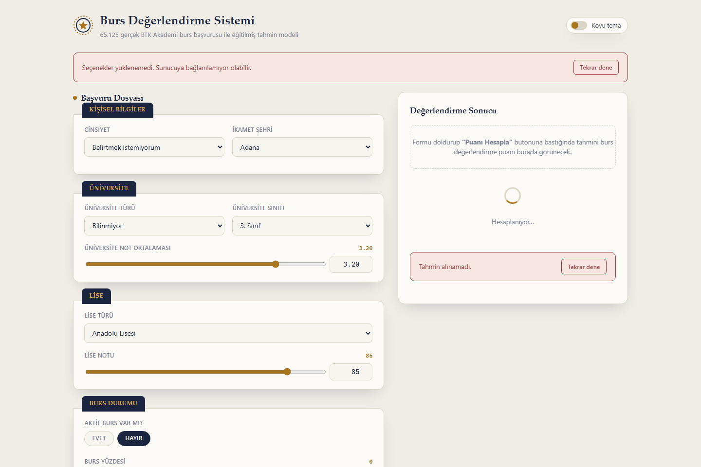

# Scholarship Evaluation System — BTK Academy Datathon


> A FastAPI web app that predicts a student's scholarship evaluation score from a Random Forest model trained on 65,125 real BTK Academy scholarship applications — and surfaces which factors actually drive the outcome.

This project placed **100th** in the BTK Academy "datathon-2024" scholarship evaluation competition on Kaggle.



## Features

- Predicts a numeric scholarship evaluation score (`predicted_score`) from 14 applicant characteristics
- Serves live feature-importance rankings alongside every prediction, so users can see *why* the model scored an application the way it did
- "Application dossier" themed UI — a navy, brass, and red official-document color palette with a wax-seal style score gauge
- Dropdown options for every categorical field are generated directly from the training data (`/options` endpoint), so the form always matches what the model actually learned
- Light/dark theme toggle
- Single-command local run, plus a ready-to-use `Dockerfile`

## Dataset & Model

The model is trained on **65,125 real, Turkish-language scholarship applications** from the BTK Academy "datathon-2024" competition dataset (`datathon_data/train.csv`), not synthetic or toy data.

**Target**: `Degerlendirme Puani` (evaluation score)

**14 input features**:

| Feature | Description |
|---|---|
| `gender` | Applicant's gender |
| `residence_city` | City of residence |
| `university_type` | State (`Devlet`) or private (`Özel`) university |
| `university_year` | Current university year |
| `university_gpa` | University GPA (0-4 scale) |
| `high_school_type` | High school type (Anadolu, Fen, Meslek, İmam Hatip, ...) |
| `high_school_grade` | High school graduation grade (normalized 0-100) |
| `has_scholarship` | Currently holds a scholarship (`Evet`/`Hayır`) |
| `scholarship_percentage` | Scholarship coverage percentage |
| `mother_education` | Mother's education level |
| `father_education` | Father's education level |
| `sibling_count` | Number of siblings |
| `entrepreneurship_club_member` | Member of an entrepreneurship club |
| `knows_english` | Self-reported English proficiency |

**Model**: `RandomForestRegressor` (300 trees, max depth 18) — **test R² = 0.622**

**The standout finding**: the single strongest predictor of a student's evaluation score turned out to be **entrepreneurship club membership**, accounting for roughly **44% of total feature importance** — well ahead of academic metrics like GPA or high school grade. That's a genuinely surprising result for a scholarship-evaluation dataset, and it's the headline insight this project surfaces via its feature-importance panel.

**Data cleaning challenge**: the raw grade columns arrived in mixed formats — some records used a 0-100 scale, others a 0-4 GPA scale, sometimes as ranges (e.g. `"75 - 100"` or `"4.00 - 3.50"`). A regex-based parser (`parse_grade_100` in `app/main.py`) extracts the numeric values, infers the scale from their magnitude, and normalizes everything onto a consistent 0-100 scale before training.

## Tech Stack

| Category | Tools |
|---|---|
| Backend | Python, FastAPI, Uvicorn |
| ML | scikit-learn (`RandomForestRegressor`, `LabelEncoder`) |
| Data | pandas, NumPy |
| Templating | Jinja2 |
| Frontend | Vanilla JavaScript, HTML/CSS |
| Deployment | Docker |

## Run Locally

**Prerequisites**: Python 3.11+

```bash
git clone https://github.com/ErdoganPeker/Student-Evaluation-System-BTK-Academy-Competition.git
cd Student-Evaluation-System-BTK-Academy-Competition/app

python -m venv .venv
.venv\Scripts\activate      # Windows
# source .venv/bin/activate # macOS/Linux

pip install -r requirements.txt
python main.py
```

The model trains automatically on startup (a few seconds), then the app is available at **http://localhost:5006**.

### Run with Docker

```bash
docker build -t scholarship-evaluation .
docker run -p 8000:8000 scholarship-evaluation
```

## Developer

**Erdoğan Yasin Peker**
[GitHub](https://github.com/ErdoganPeker) · [LinkedIn](https://www.linkedin.com/in/erdogan-yasin-peker-b107ba24b/)
